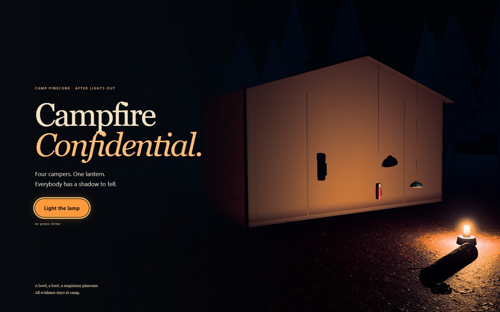
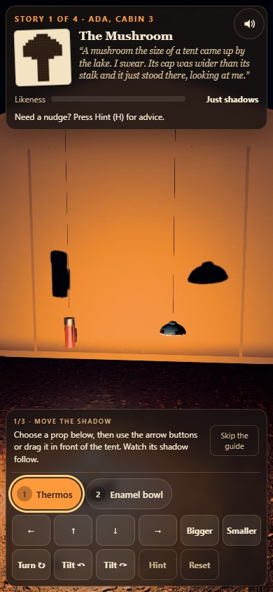
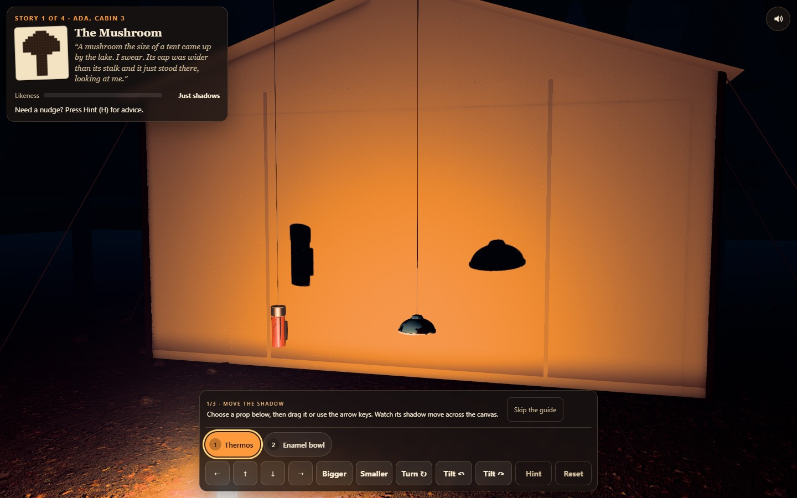

# CAMPFIRE CONFIDENTIAL

<p align="center"></p>

Hang the camp's odds and ends in front of a lantern until their shadows tell a story. Four campers have seen a mushroom, rabbit, snail and rocket. Move, turn, tilt and resize the props until the tent agrees with them.

**[Light the lamp →](https://13-campfire-confidential.williamking.workers.dev)** · [Run locally](#run-locally) · [Credits](#credits)

<p align="center"></p>

## Tell a secret with a shadow

The opening approaches the lantern-lit tent. Choose **Light the lamp** or press Enter, then follow the three-step guide: move a shadow, change its silhouette and tell a secret. **How to play** reopens help; reduced motion cuts into the same puzzle without the approach.

Each story uses two to four hanging props. Match the camper's sketch with their combined shadow, then let go to settle the arrangement. A shape can count at different positions, sizes or mirrored orientation. Every required prop still has to participate; hiding one outside the useful scene cannot create a win.

| Action | Keyboard | Pointer or touch |
| --- | --- | --- |
| Select a prop | 1–4, comma/period to cycle | Prop or chip |
| Move the shadow | Arrows | Drag or directional buttons |
| Change shadow size | + / − | Wheel, pinch, Bigger / Smaller |
| Turn | Q / E | Turn control |
| Tilt | Z / X | Tilt controls |
| Hint, then trace | H | Hint, then Trace it |
| Reset the story | R | Reset |
| Toggle sound | M | Sound |

The live likeness meter gives feedback as you work. Advice names a prop and a useful change; the chalk trace is available if the sketch is still hard to read. Completed shadows come alive: the mushroom sways, rabbit hops, snail crawls and rocket rises. Finish all four to see the illustrated tableau and replay option.

## How the shadows are judged

Each prop is built from convex solids. A pure projection function casts those solids from the lantern onto the tent, then rasterises the combined silhouette. Normalisation makes position and scale flexible; overlap, mirrored comparison and participation determine the score. The scene uses the same lamp position for the visible shadow.

The current input system settles drags and pinches, keeps held controls from leaking across dialogs and respects physical floor bounds. Compact layouts keep the story, guide and action controls readable. The renderer uses adaptive quality, prepared shaders and finite-colour protection, while scene and audio resources are released on teardown.

## Verification and source

Application revision `9175ad3` passed **89 tests / 1,876 assertions**, independent projection checks and **1,344 floor configurations**. Five RTX 2060 scenarios cover all four stories, ending/replay, touch layouts, stationary pinch settlement and live motion/input edges. See the [intro and audit report](docs/visual/INTRO-2026-09-30.md).

[src/game/](src/game/) owns projection and scoring; [src/scene/](src/scene/) owns the lantern, tent and props; [src/ui/](src/ui/) owns story controls; [src/audio/](src/audio/) combines the credited harp, ambience and effects with synthesised details.

## Current screenshots

| Desktop | Phone |
| --- | --- |
|  |  |



The opening loop and three main screenshots were captured from the live site on **1 October 2026**, using Chrome on this workstation; the phone image is a 390 × 844 browser viewport. The animated preview is a short loop, not a full playthrough. [Capture details](docs/readme/capture.json).

## Run locally

Use **Bun 1.3.10** (the version pinned in `package.json`) and Node.js 22.12 or newer. From this repository:

```sh
bun install --frozen-lockfile
bun run dev      # http://127.0.0.1:4523/
bun run check    # strict types, Biome, unit tests and production build
bun run preview  # http://127.0.0.1:4623/ after the build
```

Development and preview are separate long-running commands; run one at a time or use separate terminals. `bun run build` writes the static production output to `dist/`. Dependencies and the lockfile are local to this project.

### Browser suite

Install the test browser once, then run the checked-in Playwright suite. Its configuration builds and starts the production preview. Browser scenarios are separate from `bun run check`.

```sh
bunx playwright install chromium
bun run test:e2e
```

The recorded real-GPU release checks used installed Chrome on an RTX 2060; the default Chromium configuration is not a claim of physical-phone coverage.

## Stack and release

Direct Three.js 0.186 · React 19.3 · strict TypeScript · Vite 8.3 · GSAP 3.15 · Tailwind CSS 4.3 · Bun 1.3.10 · Biome. The public website is served by Cloudflare Workers. This README describes [application revision 9175ad3](https://github.com/WilliamHenryKing/13-campfire-confidential/commit/9175ad336111a33556e8d864bea581ce0e95fd44); the documentation refresh changes no application behaviour.

## Credits

Geometry and type are made in code or use system fonts. Every shipped file is listed with source, author, licence, date, sha256 and processing in [`assets.manifest.json`](assets.manifest.json). That comes to 7.8 MB: textures as WebP 1K in `public/textures/` and audio as 64 kbps MP3 in `public/audio/`.

| Texture / HDRI | Source | Author | Licence |
| --- | --- | --- | --- |
| Tent canvas | [Rough Linen](https://polyhaven.com/a/rough_linen) | colormass, Rico Cilliers | CC0 |
| Forest floor, stones, pine needles | [Forest Floor](https://polyhaven.com/a/forest_floor) | eye-candy.xyz | CC0 |
| Enamel and paint wear, steel roughness | [Rusty Painted Metal](https://polyhaven.com/a/rusty_painted_metal) | Amal Kumar | CC0 |
| Spoons, poles, log ends | [Fine Grained Wood](https://polyhaven.com/a/fine_grained_wood) | Rob Tuytel | CC0 |
| Boot | [Brown Leather](https://polyhaven.com/a/brown_leather) | Rob Tuytel | CC0 |
| Pine cone, log, pines, stump | [Bark Brown 02](https://polyhaven.com/a/bark_brown_02) | Rob Tuytel | CC0 |
| Night sky and environment | [Kloppenheim 02 (pure sky)](https://polyhaven.com/a/kloppenheim_02_puresky) | Greg Zaal, Jarod Guest | CC0 |

The pipeline, glass shader and grade are adapted from ODD TIDE (same author, reuse authorised).

| Audio | Source | Author | Licence |
| --- | --- | --- | --- |
| `music-meadow-thoughts.mp3` | [Meadow Thoughts](https://opengameart.org/content/meadow-thoughts) (solo harp) | Écrivain | CC0 |
| `amb-crickets.mp3` | [Crickets Ambient Noise – loopable](https://opengameart.org/content/crickets-ambient-noise-loopable) | Wolfgang_ | CC0 |
| `amb-fire.mp3` | [Fireplace Sound loop](https://opengameart.org/content/fireplace-sound-loop) | PagDev | CC0 |
| `sfx-grab`, `sfx-turn`, `sfx-tilt`, `sfx-pick-metal`, `sfx-pick-leather`, `sfx-reset`, `sfx-page`, `sfx-lamp`, `sfx-paint` | [RPG Audio](https://kenney.nl/assets/rpg-audio) | Kenney (kenney.nl) | CC0 |
| `sfx-tick`, `sfx-depth`, `sfx-hint`, `sfx-trace`, `sfx-close` | [Interface Sounds](https://kenney.nl/assets/interface-sounds) | Kenney (kenney.nl) | CC0 |
| `sfx-settle`, `sfx-pick-wood`, `sfx-pick-enamel` | [Impact Sounds](https://kenney.nl/assets/impact-sounds) | Kenney (kenney.nl) | CC0 |
| `sfx-click` | [UI Audio](https://kenney.nl/assets/ui-audio) | Kenney (kenney.nl) | CC0 |
| `amb-wind.mp3` (low-passed) | [Wind Woosh Loop](https://opengameart.org/content/wind-woosh-loop) | SketchMan3 | CC0 |
| `sfx-told`, `sfx-finale` | [Music Jingles](https://kenney.nl/assets/music-jingles) (Pizzicato 10, Steel 10) | Kenney (kenney.nl) | CC0 |

The lantern hiss and the distant owl are synthesised with Web Audio in `src/audio/engine.ts`. CC0 needs no attribution. The credits are given anyway.

---

Part of [William King's portfolio collection](https://github.com/WilliamHenryKing).
