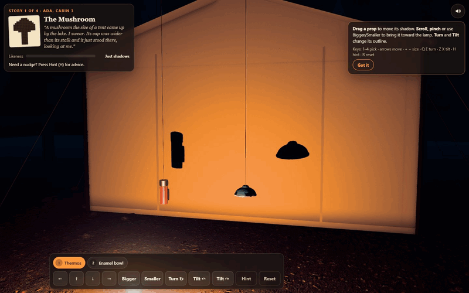
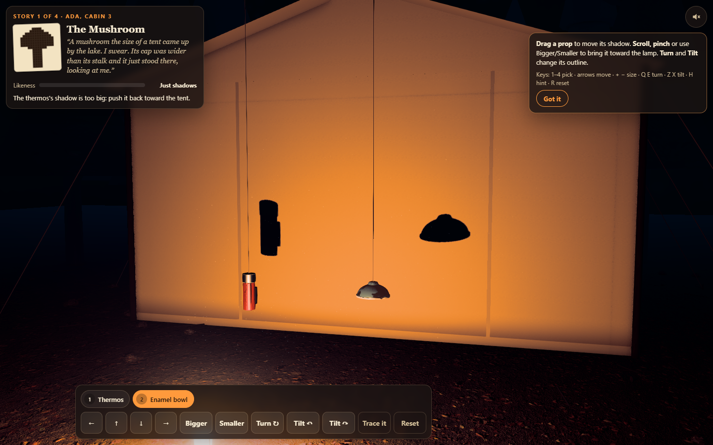
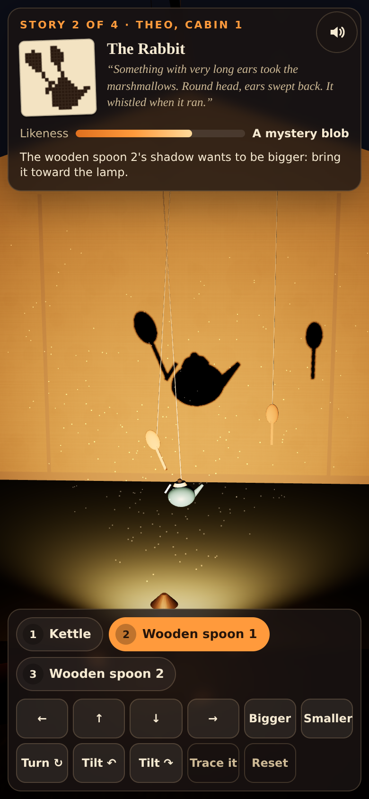

<p align="center">
  
</p>

<p align="center">
  <a href="https://13-campfire-confidential.williamking.workers.dev"></a>
  <a href="https://threejs.org"></a>
  <a href="https://www.typescriptlang.org"></a>
  <a href="https://vite.dev"></a>
  <a href="https://bun.sh"></a>
  <a href="https://tailwindcss.com"></a>
  <a href="https://gsap.com"></a>
</p>

<p align="center"><b>Hang the camp's odds and ends in front of a lantern until their shadows on the tent tell the campers' strangest secrets.</b></p>

<p align="center">
  
</p>

## How to play

Approach the lantern-lit tent through the campsite, then choose **Light the lamp** or press Enter to glide into its shadow theatre. A three-step guide follows your actual actions: move a shadow, change its silhouette, then tell a secret. Skip it or replay it from **How to play**. Reduced motion cuts directly into play.

Four campers each report a strange sighting: a mushroom, a rabbit, a snail and a rocket. The camper's sketch shows the figure. Arrange two to four hanging props until their combined shadow matches it, then let go. It counts anywhere on the wall, at any size and even mirrored.

| Action | Keyboard | Mouse / touch |
| --- | --- | --- |
| Pick a prop | `1`–`4`, or `,` / `.` to cycle | Tap the prop or its chip |
| Move its shadow | Arrow keys | Drag the prop, or the ← ↑ ↓ → buttons |
| Bigger / smaller shadow | `+` / `−` | Scroll, pinch, or **Bigger** / **Smaller** |
| Turn the prop | `Q` / `E` | **Turn ↻** |
| Tilt the prop | `Z` / `X` | **Tilt ↶** / **Tilt ↷** |
| Hint: advice, then a chalk trace | `H` | **Hint** → **Trace it** |
| Reset the story | `R` | **Reset** |
| Sound on / off (remembered) | `M` | 🔊 button, top right |

## What's inside

- **Real shadows, fairly judged.** The rendered shadow is the one being scored. Your figure is compared by shape, not by pixel position, so there is no single hidden answer.
- **Four stories and a finale.** Each told secret brings its figure to life: the mushroom sways, the rabbit hops, the snail crawls and the rocket lifts off. The last story ends on a painted storyboard of your own shadows.
- **Feedback that helps.** A live likeness meter, and advice that names one prop and one change ("the kettle's shadow wants to be bigger"). A chalk trace of the sketch follows if you need it.
- **Cosy sound design.** A harp loop, crickets, fire and canvas wind, plus a clink per material, creaks, rising ticks as the likeness climbs, and a reveal sting.
- **A real lantern night.** A pressure lantern is the only key light, so real shadows fall on a woven canvas tent. The props are chipped enamel, grained wood and worn leather, and they swing on their strings in air full of drifting dust.
- **Made for everyone.** Mouse, touch and keyboard, labelled controls with visible focus, and a phone layout. `prefers-reduced-motion` turns off every animation.

## Screenshots

<table>
  <tr>
    <td width="68%"></td>
    <td width="32%"></td>
  </tr>
  <tr>
    <td align="center">Desktop, 1440 × 900</td>
    <td align="center">Phone, 390 × 844</td>
  </tr>
</table>

## Built with

Three.js 0.186 (no framework wrapper), React 19 for the HUD, TypeScript (strict), Vite, Bun, Tailwind CSS v4, GSAP and Biome. Geometry is built in code. Surfaces use CC0 Poly Haven scans, and the rendering is physically based: an HDR composer with GTAO, thresholded bloom, a scotopic grade, Neutral tone mapping applied once, and SMAA. See `docs/visual/AUDIT.md`.

- **Shadow projection you can test.** Each prop is a union of convex solids. `src/game/shadow.ts` projects every solid from the lamp onto the tent plane, takes the convex hull and rasterises it into a mask. The three.js point light sits at exactly the same lamp position, so what you see is what is scored.
- **Likeness that ignores where and how big.** A figure is centred on its centroid and scaled by √area into a 48 × 48 grid. It is then compared with the target by overlap (Dice), straight and mirrored. A participation factor makes every prop pull its weight, and each story has its own pass mark. Unit tests check that the known answer passes, that small slips still pass, and that random clutter almost never does.
- **One light, two uses.** The lantern's point light sits at exactly the lamp position the rules project from, so the rendered shadow map *is* the judged figure. The canvas shader adds thin-fabric translucency, so from outside the tent the shadow play glows through.
- **Advice from geometry.** Each prop's shadow is compared with its counterpart in a known answer, relative to the figure's largest prop. The biggest error, in the order size → outline → position, becomes one plain sentence.

## Run it locally

```sh
bun install
bun run dev        # http://127.0.0.1:4523/
bun run check      # strict tsc, Biome, bun test, production build into dist/
bun run test:e2e   # Playwright: four stories, finale/replay, guide and touch layouts
# visual evidence and README media, against a running preview:
node tools/visual/capture.mjs <set>   # docs/visual/captures/<set>/
node tools/visual/readme-media.mjs    # docs/readme/{desktop,phone}.png, preview.gif
```

Append `?tier=low` for the phone tier, or `?e2e` for the capture hook (`window.__VISUAL_TEST__`).

## Credits

Geometry and type are made in code or use system fonts. Every shipped file is listed with source, author, licence, date, sha256 and processing in [`assets.manifest.json`](assets.manifest.json). That comes to 7.8 MB: textures as WebP 1K in `public/textures/` and audio as 64 kbps MP3 in `public/audio/`.

| Texture / HDRI | Source | Author | Licence |
| --- | --- | --- | --- |
| Tent canvas | [Rough Linen](https://polyhaven.com/a/rough_linen) | colormass, Rico Cilliers | CC0 |
| Forest floor, stones, pine needles | [Forest Floor](https://polyhaven.com/a/forest_floor) | eye-candy.xyz | CC0 |
| Enamel and paint wear, steel roughness | [Rusty Painted Metal](https://polyhaven.com/a/rusty_painted_metal) | Amal Kumar | CC0 |
| Spoons, poles, log ends | [Fine Grained Wood](https://polyhaven.com/a/fine_grained_wood) | Rob Tuytel | CC0 |
| Boot | [Brown Leather](https://polyhaven.com/a/brown_leather) | Rob Tuytel | CC0 |
| Pine cone, log, pines, stump | [Bark Brown 02](https://polyhaven.com/a/bark_brown_02) | Rob Tuytel | CC0 |
| Night sky and environment | [Kloppenheim 02 (pure sky)](https://polyhaven.com/a/kloppenheim_02_puresky) | Greg Zaal, Jarod Guest | CC0 |

The pipeline, glass shader and grade are adapted from ODD TIDE (same author, reuse authorised).

| Audio | Source | Author | Licence |
| --- | --- | --- | --- |
| `music-meadow-thoughts.mp3` | [Meadow Thoughts](https://opengameart.org/content/meadow-thoughts) (solo harp) | Écrivain | CC0 |
| `amb-crickets.mp3` | [Crickets Ambient Noise – loopable](https://opengameart.org/content/crickets-ambient-noise-loopable) | Wolfgang_ | CC0 |
| `amb-fire.mp3` | [Fireplace Sound loop](https://opengameart.org/content/fireplace-sound-loop) | PagDev | CC0 |
| `sfx-grab`, `sfx-turn`, `sfx-tilt`, `sfx-pick-metal`, `sfx-pick-leather`, `sfx-reset`, `sfx-page`, `sfx-lamp`, `sfx-paint` | [RPG Audio](https://kenney.nl/assets/rpg-audio) | Kenney (kenney.nl) | CC0 |
| `sfx-tick`, `sfx-depth`, `sfx-hint`, `sfx-trace`, `sfx-close` | [Interface Sounds](https://kenney.nl/assets/interface-sounds) | Kenney (kenney.nl) | CC0 |
| `sfx-settle`, `sfx-pick-wood`, `sfx-pick-enamel` | [Impact Sounds](https://kenney.nl/assets/impact-sounds) | Kenney (kenney.nl) | CC0 |
| `sfx-click` | [UI Audio](https://kenney.nl/assets/ui-audio) | Kenney (kenney.nl) | CC0 |
| `amb-wind.mp3` (low-passed) | [Wind Woosh Loop](https://opengameart.org/content/wind-woosh-loop) | SketchMan3 | CC0 |
| `sfx-told`, `sfx-finale` | [Music Jingles](https://kenney.nl/assets/music-jingles) (Pizzicato 10, Steel 10) | Kenney (kenney.nl) | CC0 |

The lantern hiss and the distant owl are synthesised with Web Audio in `src/audio/engine.ts`. CC0 needs no attribution. The credits are given anyway.

---

<p align="center"><sub>Part of William King's portfolio collection</sub></p>
